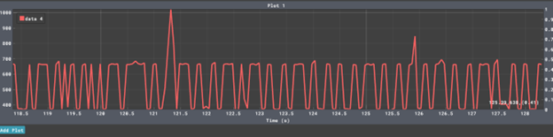

# Adaptive IoT Sampling and Aggregation System

This repository implements an energy-efficient IoT system using an ESP32 board with FreeRTOS. The device collects sensor data, performs FFT-based local signal analysis to determine the dominant frequency, and then adapts its sampling frequency accordingly. It computes an average over a fixed 10-second window and transmits this aggregated value via two channels: MQTT over WiFi to an edge server and LoRaWAN (via OTAA) to the cloud (using The Things Network).

The primary goal is to conserve energy by reducing unnecessary high-frequency sampling while ensuring a constant, minimal communication load over the network.

---

## Project Overview

### Objectives

- **Efficient Signal Analysis:**  
  The system initially samples the sensor signal at a very high rate to perform Fast Fourier Transform (FFT) analysis. This process identifies the dominant frequencies present in the signal. Based on the Nyquist theorem, the device then computes an optimal sampling frequency (set to twice the maximum significant frequency), thereby avoiding oversampling and saving energy.

- **Adaptive Sampling & Power Management:**  
  After the FFT phase, the adaptive sampling frequency is “locked in” and the device switches from high-frequency sampling to a lower, optimal rate. It enters deep sleep mode between sampling intervals, significantly reducing energy consumption.

- **Data Aggregation and Consistent Payload:**  
  The system aggregates sensor readings over a fixed 10-second window. Regardless of whether the device uses oversampling or adaptive sampling, it transmits only one aggregated value, resulting in a consistent 6-byte payload every 10 seconds (or 36 bytes per minute), thereby maintaining a constant network load.

- **Dual Communication Channels:**  
  The aggregated result is transmitted via MQTT (over WiFi) to an edge server and via LoRaWAN to the cloud (using OTAA on TTN).

---

## Key System Components and Important Variables

### Network and Time Synchronization
- **NTP Sync Variables:**  
  - `g_ntpEpoch`: Holds the epoch time from the last NTP sync.  
  - `g_syncMillis`: Stores the system uptime (via `millis()`) at the time of synchronization.
- **IP Configuration:**  
  Variables such as `local_IP`, `gateway`, `subnet`, `primaryDNS`, and `secondaryDNS` ensure stable connectivity.
- **NTP Server:**  
  The system uses an NTP server (e.g., "time.google.com") with offsets (`gmtOffset_sec` and `daylightOffset_sec`) for accurate timestamping, which is crucial for latency measurements.

### LoRaWAN and MQTT Configurations
- **LoRaWAN Settings:**  
  Parameters such as `devEui`, `appEui`, and `appKey`, along with the channel mask, ensure proper cloud communication via the LoRaWAN network.
- **WiFi and MQTT Setup:**  
  WiFi is configured using the credentials (`ssid_wifi` and `password_wifi`), and the MQTT client is set up with the Mosquitto broker details (`mqtt_server`, `mqtt_port`, `mqtt_topic`, `client_id`).

### Sampling and FFT Analysis
- **Sampling Constants:**  
  - `WINDOW_SIZE`: Defines the number of samples used for FFT analysis (must be a power of 2, e.g., 128).
  - `MAX_SAMPLING_FREQ`: The maximum rate at which the device is capable of sampling.
- **Adaptive Variables:**  
  - `currentSamplingFreq`: Holds the active sampling frequency.  
  - `lockedAdaptiveFreq`: Stored in RTC memory to preserve the optimal frequency across deep sleep cycles.
- **FFT Computation:**  
  The `arduinoFFT` library is used to process sensor data stored in arrays `vReal` and `vImag`. The computation identifies the dominant frequency, and the optimal sampling frequency is set accordingly (optimal = 2 × dominant frequency).

### Data Aggregation and Transmission
- **Aggregation Window:**  
  Sensor data is aggregated over a 10-second interval defined by `AGGREGATE_WINDOW_MS`.
- **Communication Load:**  
  The sensor’s average reading (formatted to four decimal places) is transmitted as a fixed 6-byte payload every 10 seconds, ensuring a consistent network load regardless of internal sampling strategy.

### Power Management
- **Deep Sleep Mode:**  
  After adaptive sampling is established, the device enters deep sleep (using `esp_deep_sleep()`) between transmission intervals, significantly reducing overall power consumption.

---

## Performance Evaluation

### Energy Consumption

Energy consumption is evaluated using real-world measurements with an INA219 current sensor. The measurements capture the actual power usage during different operating phases such as FFT processing, deep sleep, and transmission bursts.

- **Observations:**  
  - During deep sleep, the power consumption drops dramatically, confirming significant energy savings.
  - Power consumption is higher during active phases (FFT and transmissions), but these periods are short compared to the low-power sleep periods.
  - The INA219 sensor data validates that the adaptive sampling strategy is highly effective at reducing overall energy usage.

*Visual Evidence:*  
-   
-   
- 

### Data Transmission Volume

A Python script running on the edge server (using the Mosquitto broker for MQTT) measures the payload size of each message. Each MQTT message contains a single floating-point value (e.g., `"1.0000"`) representing the aggregated sensor data over a 10-second period.

- **Payload Details:**  
  - **Content:** `"1.0000"`  
  - **Size:** 6 bytes (UTF-8 encoded)
  
Because both the oversampled and adaptive systems transmit the same type of message at the same fixed interval (every 10 seconds), the total data transmitted is constant:

Messages per minute = 60 / 10 = 6
Total volume per minute = 6 messages × 6 bytes = 36 bytes

**Conclusion:**  
The data transmission volume is identical for both sampling methods—36 bytes per minute—since only the aggregated value is transmitted.

*Visual Evidence:*  
- 

### End-to-End Latency

End-to-end latency is measured as the time delay from data generation on the ESP32 to the reception of the MQTT message at the broker. Both the ESP32 and the PC use NTP servers for synchronized timestamps, ensuring precise latency calculations.

- **Method:**  
  - The ESP32 timestamps the message when it is published.
  - The PC (running the Python script) also synchronizes with NTP and records the reception timestamp.
  - The difference between these timestamps yields the end-to-end latency.
  
- **Result:**  
  The average latency is approximately 215 milliseconds, which is acceptable for most real-time IoT applications.

*Visual Evidence:*  
- 
- 
- 

### Real-World Power Measurements

The INA219 sensor provided actual power usage readings during various operational states, confirming that the adaptive sampling approach yields substantial energy savings compared to continuous high-rate sampling.

*Visual Evidence:*  
-   
-   
- 

---

## Circuit Diagram

The following circuit diagram shows the system setup, including the ESP32 board, INA219 current sensor, and other essential components.

- 

---

## Setup and Usage

### Prerequisites

- **Hardware:**  
  - ESP32 board (e.g., Heltec WiFi LoRa V3)  
  - INA219 current sensor (for power measurement verification)
- **Network Components:**  
  - A WiFi network with an MQTT broker (e.g., Mosquitto)  
  - A LoRaWAN gateway and an active TTN account
- **Software Requirements:**  
  - Arduino IDE or PlatformIO for firmware development and flashing  
  - Python (or similar) for running the MQTT monitoring script

### Installation Steps

1. **Clone the Repository:**
   ```bash
   git clone https://github.com/your-username/adaptive-iot-sampling.git
   cd adaptive-iot-sampling

2. **Configure the Firmware:**
Update configuration parameters (WiFi credentials, MQTT settings, LoRaWAN parameters) in the source code to match your environment.

3. **Build and Upload:**
Open the project in your Arduino IDE or PlatformIO, compile, and flash the firmware onto your ESP32 board.

4. **Monitor the System:**
Run the provided Python script (e.g., mqtt_timestamp.py) on your PC to monitor incoming MQTT messages, verify payload sizes, and check latency. Review the images in the images folder for detailed performance insights.


## Conclusion
This project demonstrates an effective adaptive sampling strategy for IoT systems. By leveraging FFT analysis to dynamically adjust the sampling frequency and incorporating deep sleep modes, the system achieves significant energy savings while maintaining a constant network load. With a fixed 6-byte payload sent every 10 seconds and an average end-to-end latency of approximately 215 ms, the system is well-suited for energy-sensitive and bandwidth-constrained IoT applications.    

## Author
Ali Subhan
EMAI
