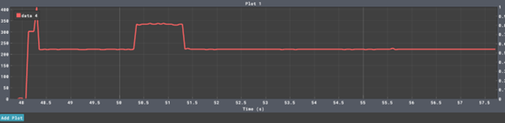

# Adaptive IoT Sampling and Aggregation System

This repository contains the implementation of an IoT system based on the ESP32 and FreeRTOS. The system collects sensor data, performs local FFT analysis to determine the optimal sampling frequency, aggregates sensor readings, and transmits the aggregated results to both an edge server (via MQTT over WiFi) and the cloud (via LoRaWAN and TTN). The design also includes energy-saving strategies that reduce the system's power consumption compared to traditional oversampled systems.

---

## Project Overview

This project aims to optimize energy usage and reduce communication overhead while preserving data quality. The key aspects include:

- **Local Signal Analysis (FFT):**  
  A high-frequency sampling phase is used to perform an FFT on the sensor signal to detect the dominant frequency components. The Nyquist principle is then applied to set an optimal sampling frequency (twice the maximum detected frequency).

- **Adaptive Sampling & Deep Sleep:**  
  After computing the optimal sampling rate, the device switches to this rate and enters a deep sleep mode between sampling intervals. This approach dramatically reduces power consumption compared to continuous oversampling.

- **Data Aggregation & Transmission:**  
  The system aggregates sensor readings over a fixed 10-second window. The aggregated (averaged) value is then transmitted using:
  - **MQTT over WiFi:** to a local edge server.
  - **LoRaWAN:** to a cloud server via TTN.

*Note:* Regardless of the sampling strategy, both systems transmit only one aggregated value every 10 seconds. Therefore, the payload size remains constant.

---

## System Operation

1. **FFT Phase:**  
   At start-up, the system samples the signal at maximum frequency for a short duration to run the FFT. The results from the FFT determine the dominant frequency and help set the optimal sampling frequency based on the Nyquist criterion.

2. **Adaptive Sampling:**  
   Following the FFT phase, the ESP32 adapts its sampling frequency to a lower rate (optimal frequency), reducing the amount of processing and energy consumption.

3. **Deep Sleep & Wake-Up:**  
   The device enters deep sleep to conserve energy. It wakes up periodically (every 10 seconds) to sample the signal, compute the average over that interval, and then transmit the aggregated data.

4. **Data Transmission:**  
   The aggregated value (formatted as a 4-decimal floating point number) is transmitted via MQTT and LoRaWAN. Measurements indicate that the payload size is exactly 6 bytes per message, regardless of whether the system uses oversampling or adaptive sampling.

---

## Performance Evaluation

### Energy Consumption

The adaptive system dramatically reduces energy consumption. By processing raw data internally and only transmitting the essential aggregated value, the device is able to remain in a low-power sleep mode most of the time. Energy consumption was calculated using trapezoidal integration on the power curves, and our results show significant savings with the adaptive approach compared to continuous high-frequency sampling.

*See the energy saving graph and detailed measurements (provided as images in the `images` folder):*

  


---

### Data Transmission Volume

Despite the change in internal sampling frequency, both systems send the same network payload:
- **Payload Content:** The average reading (e.g., "1.0000")
- **Payload Size:** 6 bytes per message
- **Transmission Interval:** Every 10 seconds

This results in a constant transmission load (36 bytes per minute), regardless of whether oversampling or adaptive sampling is used. This metric was verified with a PC-based MQTT monitoring script.


---

### End-to-End Latency

End-to-end latency was measured by capturing timestamps at the point the ESP32 publishes the MQTT message and at the point the message is received by the MQTT broker. The average measured latency is approximately 215 ms, indicating that the communication path is both reliable and timely for practical IoT applications.


---

### Real-World Power Measurements

Power consumption was additionally validated using an INA219 sensor connected to an Arduino. The INA219 provided real-world current measurements during various operating phases (FFT, deep sleep, transmission). These images confirm that the adaptive sampling strategy leads to significant power savings.

  
  


---

## How to Set Up and Run the System

### Prerequisites
- **Hardware:** ESP32 board (e.g., Heltec WiFi LoRa V3), INA219 current sensor (for power measurements)
- **Network:** Access to a WiFi network, MQTT broker (e.g., Mosquitto), and a LoRaWAN gateway / TTN account.
- **Software:** Arduino IDE or PlatformIO for firmware development, and Python for edge monitoring.

### Instructions
1. **Clone the Repository:**
   ```bash
   git clone https://github.com/your-username/adaptive-iot-sampling.git
   cd adaptive-iot-sampling
